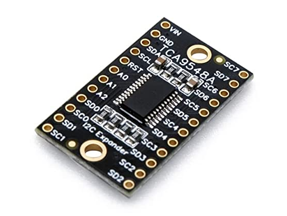
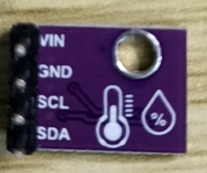
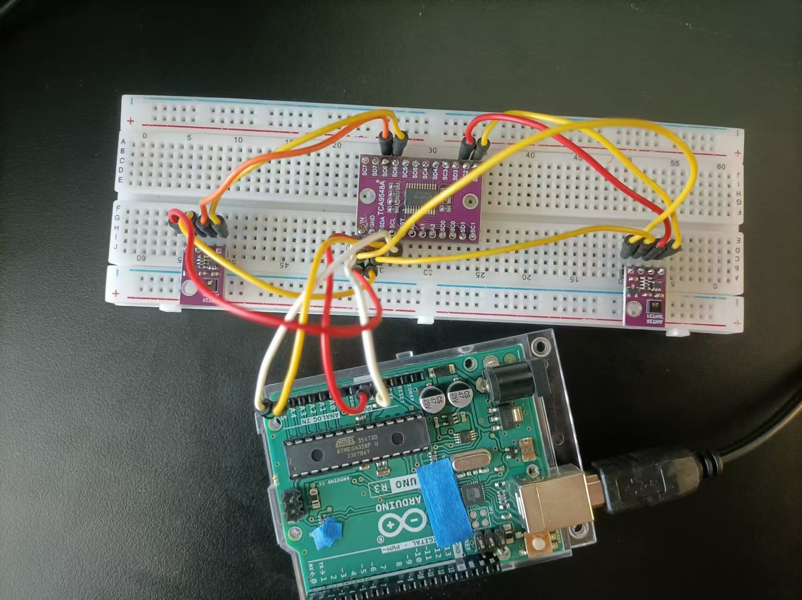
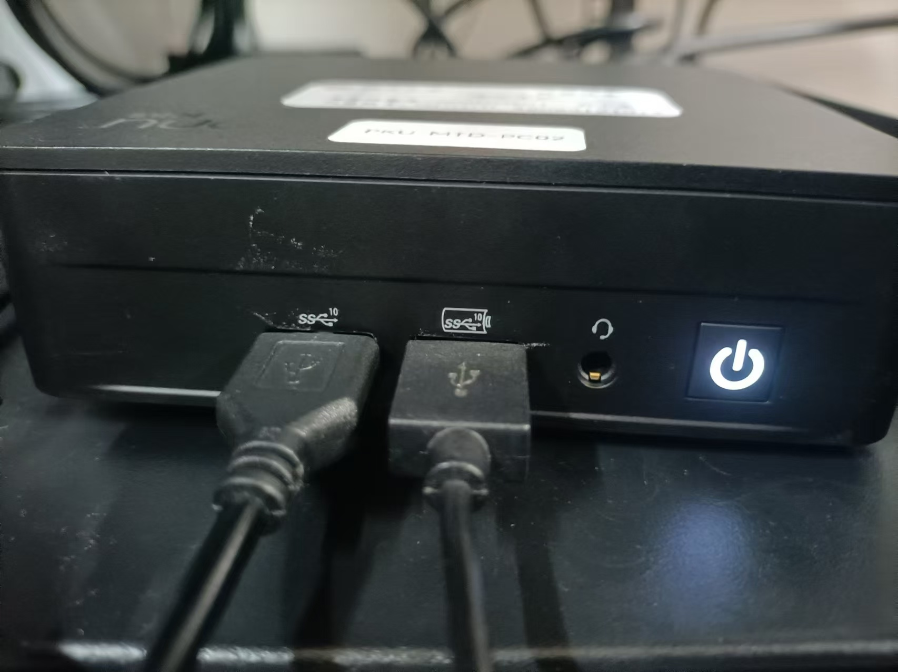
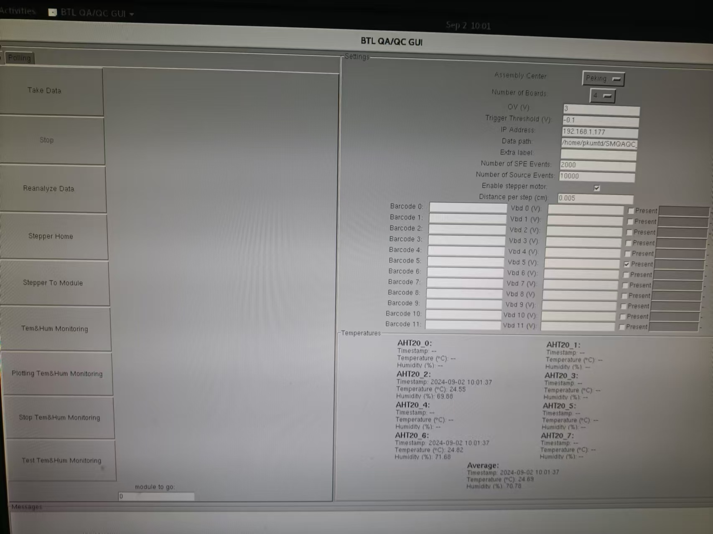
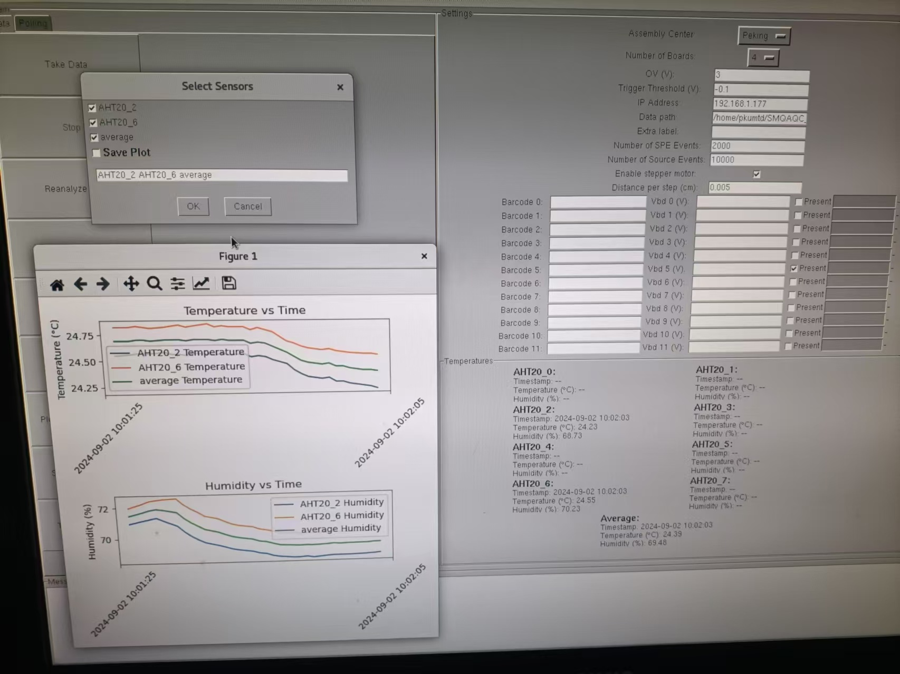
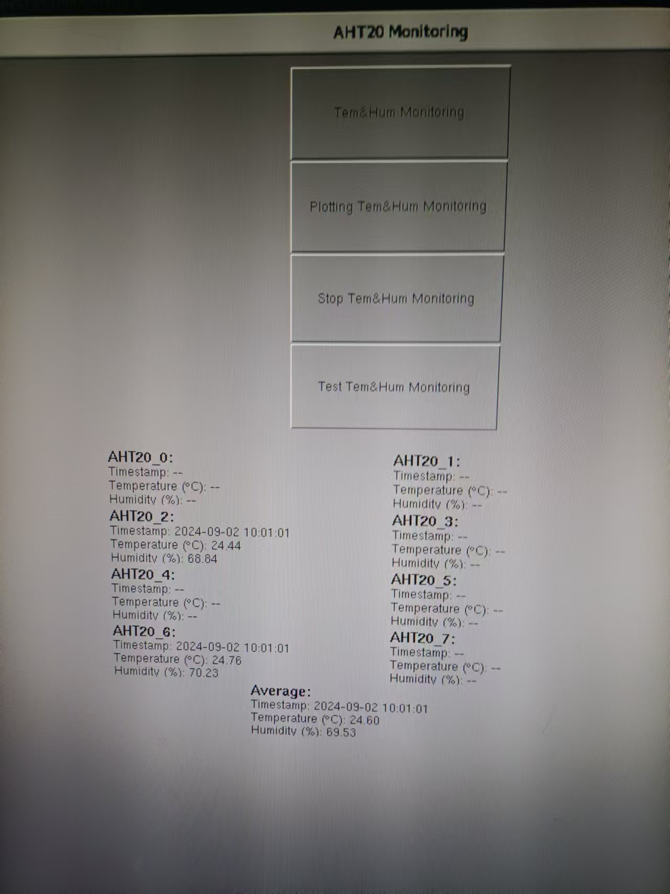
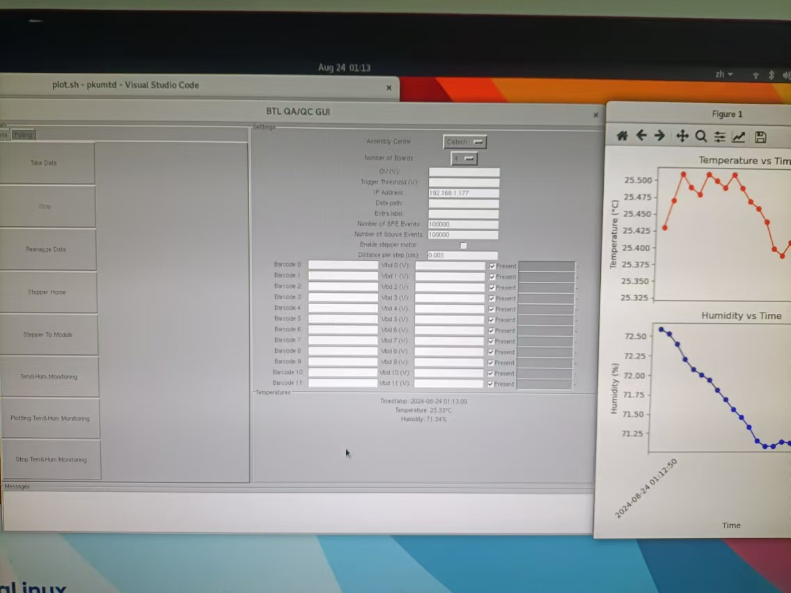

# TCA9548A & Arduino Uno

| AHT20 引脚 | Arduino Uno 引脚 |
|------------|------------------|
| SCL        | A5               |
| SDA        | A4               |
| VCC        | 5V               |
| GND        | GND              |
| SD*        | SDA              |
| SC*        | SCL              |


# AHT20 & Arduino Uno

| AHT20 引脚 | Arduino Uno 引脚 |
|------------|------------------|
| SCL        | A5               |
| SDA        | A4               |
| VCC        | 5V               |
| GND        | GND              |


# TCA9548A & AHT20 



# Details

See https://github.com/ky230/AHT20/blob/02bac9d1c16a3ce11920e34191d235469bc5c8cb/QAQC_PKU/TCA9548A.py#L30


If left: 
```python
serial_port = '/dev/ttyACM1'
```

If right:
```python
serial_port = '/dev/ttyACM0'
```


# New button : Test Tem&Hum Monitoring


## update Plotting button



# test.py (independent code)



# qaqc-pku-gui-TCA9548A.py

## Add new head file
https://github.com/ky230/AHT20/blob/02bac9d1c16a3ce11920e34191d235469bc5c8cb/QAQC_PKU/qaqc-gui-pku-TCA9548A.py#L27 ~  https://github.com/ky230/AHT20/blob/02bac9d1c16a3ce11920e34191d235469bc5c8cb/QAQC_PKU/qaqc-gui-pku-TCA9548A.py#L29

```python
import threading ##%
import re
import sys
```
## Add new global variable

https://github.com/ky230/AHT20/blob/02bac9d1c16a3ce11920e34191d235469bc5c8cb/QAQC_PKU/qaqc-gui-pku-TCA9548A.py#L33

```python
timestamp = None ##%
```


<!--


# TCA9548A & Arduino Uno

| AHT20 引脚 | Arduino Uno 引脚 |
|------------|------------------|
| SCL        | A5               |
| SDA        | A4               |
| VCC        | 5V               |
| GND        | GND              |
| SD*        | SDA              |
| SC*        | SCL              |


# AHT20 & Arduino Uno

| AHT20 引脚 | Arduino Uno 引脚 |
|------------|------------------|
| SCL        | A5               |
| SDA        | A4               |
| VCC        | 5V               |
| GND        | GND              |


# Installing
```bash
conda create -n AHT20 python=3.11
conda install numpy scipy matplotlib pandas h5py matplotlib pyserial 
conda config --add channels conda-forge
conda install -c conda-forge root
```
## check
```bash
python -c "import h5py; import pandas as pd; import matplotlib.pyplot as plt; import matplotlib.dates as mdates; from matplotlib.animation import FuncAnimation; import serial; import time; from btl import Client; import tkinter as tk; from tkinter import ttk; import random; from os.path import join, expanduser, exists, splitext; import json;import ROOT as R;import argparse;  from subprocess import Popen, PIPE; import subprocess; import sys; print('All packages imported successfully')"
```
# Run take data

```
source evi.sh
```

# Run plotting
```
source plot.sh`

```


# Add 3 new buttons of Tem&Hum monitoring in qaqc-gui-pku.py



##  Tem&Hum Monitoring 
Start Temparture and Humidity Monitoring  and save THdata*.txt in /home/pkumtd/Desktop/AHT20/QAQC_PKU

##  Plotting Tem&Hum Monitoring 

Real time drawing of temperature and humidity images

##  Stop Tem&Hum Monitoring
Stop Temparture and Humidity Monitoring  
⚠️：Must  click this button before exiting the GUI interface


# Details of qaqc-gui-pku.py update

## Add  head file "signal"   and  global variable ：“aht20_process”
Line 25
```python
import signal
```
Line 29
```python
aht20_process = None
```

##  Comment function read_dht22   and define our functions
### Line 698 ~ Line 704:  Comment read_dht22
```python
# def read_dht22():
#     out = Popen(['ssh', 'cmsdaq@raspcmsroma01', 'tail', '-n 1', '/home/cmsdaq/SHT40/temp.txt'],stdout=PIPE)
#     vals = (out.stdout.read().decode('utf-8')).split(',')
#     for i in range(1):
#         dht22_text[(i,'temp')].config(text="%.1f"%float(vals[0+0+2*i]))
#         dht22_text[(i,'hum')].config(text="%.1f"%float(vals[0+1+2*i]))
#     root.after(3000,read_dht22)
```


### Line 710 ~ Line 782 :  Define our functions
```python
def read_AHT20():
    """读取最新的 AHT20 数据并更新GUI"""
    # 获取最新的 .txt 文件
    file_path = max(glob.glob('/home/pkumtd/Desktop/AHT20/QAQC_PKU/*.txt'), key=os.path.getmtime)
   
    # 读取最新的文件内容
    with open(file_path, 'r') as file:
        vals = file.readlines()[-1].strip().split()  # 获取最后一行内容并分割

    # 确保数据长度正确
    if len(vals) == 4:
        timestamp = f"{vals[0]} {vals[1]}"
        temperature = f"{vals[2]}°C"
        humidity = f"{vals[3]}%"

        # 更新 GUI 显示
        AHT20_text['Time'].config(text=f"Timestamp: {timestamp}")
        AHT20_text['Temp'].config(text=f"Temperature: {temperature}")
        AHT20_text['Hum'].config(text=f"Humidity: {humidity}")
    else:
        # 处理数据格式错误
        AHT20_text['Time'].config(text="Timestamp: --")
        AHT20_text['Temp'].config(text="Temperature: --")
        AHT20_text['Hum'].config(text="Humidity: --")
   
    # 2000 毫秒后再次调用 read_AHT20
    root.after(2000, read_AHT20)

def start_AHT20_monitoring():
    """启动 AHT20.sh 并开始监控数据"""
    global aht20_process

    # 检查之前是否有正在运行的 AHT20 进程
    if aht20_process is not None:
        os.killpg(os.getpgid(aht20_process.pid), signal.SIGINT)  # 终止旧进程
        aht20_process.wait()  # 等待进程完全终止

    # 运行 AHT20.sh 脚本
    aht20_process = subprocess.Popen(
        ["/home/pkumtd/Desktop/AHT20/AHT20.sh"],
        shell=True,
        preexec_fn=os.setsid  # 设置进程组ID，使得可以向该组发送信号
    )
    # 调用 read_AHT20 函数开始读取数据
    read_AHT20()

def on_closing_AHT20():
    """关闭GUI并终止AHT20.sh进程"""
    global aht20_process
    if aht20_process is not None:
        # 发送 SIGINT 信号，相当于按下 Ctrl+C
        os.killpg(os.getpgid(aht20_process.pid), signal.SIGINT)
        aht20_process.wait()  # 等待进程结束
    root.destroy()  # 关闭 GUI 窗口    \

def draw_AHT20_monitoring():
       # 运行 AHT20.sh 脚本
     subprocess.Popen(
        ["/home/pkumtd/Desktop/AHT20/plot.sh"],
        shell=True,
        preexec_fn=os.setsid  # 设置进程组ID，使得可以向该组发送信号
    )
    

def stop_AHT20_monitoring():
    """停止 AHT20.sh 进程"""
    global aht20_process

    # 检查之前是否有正在运行的 AHT20 进程
    if aht20_process is not None:
        os.killpg(os.getpgid(aht20_process.pid), signal.SIGINT)  # 终止旧进程
        aht20_process.wait()  # 等待进程完全终止
        aht20_process = None  # 重置进程变量    
```

##  Update in main function
### Line 894 :   Add AHT20.py termination button
```python
root.protocol("WM_DELETE_WINDOW", on_closing_AHT20)
```
### Line 916 :  change qaqc-gui.py Line 811 into:
```python
frame_temps.pack(expand=1,fill='both',side=tk.BOTTOM)
```

### Add new buttons and labels  below qaqc-gui.py Line 998:  see Line 1115 ~ Line 1135
```python
    # 在 frame_temps 中添加3个标签
    AHT20_text = {}
    AHT20_text['Time'] = tk.Label(frame_temps, text="Timestamp: --", width=50)
    AHT20_text['Temp'] = tk.Label(frame_temps, text="Temperature (°C): --", width=50)
    AHT20_text['Hum'] = tk.Label(frame_temps, text="Humidity (%): --", width=50)

    AHT20_text['Time'].pack()
    AHT20_text['Temp'].pack()
    AHT20_text['Hum'].pack()


    # 创建按钮
    button_module = tk.Button(master=frame_buttons, text="Tem&Hum Monitoring", width=25, height=5, command=start_AHT20_monitoring)
    button_module.pack()

    # 创建停止按钮
    button_plot = tk.Button(master=frame_buttons, text="Plotting Tem&Hum Monitoring", width=25, height=5, command=draw_AHT20_monitoring)
    button_plot.pack()  # 设置按钮位置

    # 创建停止按钮
    button_stop = tk.Button(master=frame_buttons, text="Stop Tem&Hum Monitoring", width=25, height=5, command=stop_AHT20_monitoring)
    button_stop.pack()  # 设置按钮位置

```
-->

